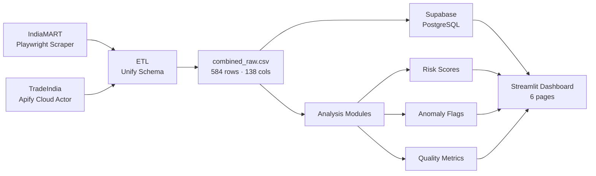

# Slooze Supply Chain Intelligence Platform

**Data Engineering Take-Home Challenge**  
Vishnu Gopal · vishnu.gopal@skypoint.ai · [github.com/Vishnug21](https://github.com/Vishnug21)

---

## Overview

End-to-end supply chain data pipeline that scrapes B2B product listings from two Indian marketplaces, unifies them into a 584-row dataset, stores it in a cloud database, and surfaces actionable supply chain insights through an interactive dashboard.

**Live Dashboard:** _(add Streamlit URL here)_  
**Live Database:** Supabase PostgreSQL · 584 rows · 138 columns

---

## Key Findings

- **Geographic concentration risk:** Gujarat accounts for 38% of all domestic suppliers — over-reliance on a single state creates supply chain vulnerability to regional disruptions.
- **International exposure:** 15% of mapped suppliers are international (Guangdong, Shanghai, Shandong, Singapore), indicating cross-border sourcing risk.
- **Platform coverage gap:** TradeIndia delivers 2.4x more structured specification data per product than IndiaMART, making it the stronger source for procurement intelligence.
- **Data quality divergence:** TradeIndia provides MOQ data for 93% of its listings vs 0% for IndiaMART — a critical gap for sourcing decisions.

---

## Pipeline Architecture



---

## Data Sources

| Source | Rows | Method | Highlights |
|---|---|---|---|
| IndiaMART | 236 | Playwright (headless, anti-bot bypass) | Product name, category, source tracking |
| TradeIndia | 348 | Apify cloud actor | 100+ spec fields, MOQ, price, state, businessType |
| **Combined** | **584** | Schema union + source tagging | **138 columns** |

Going multi-source was a deliberate choice — it enables cross-platform supplier comparison, price gap analysis, and data quality benchmarking that a single-source scrape cannot provide.

---

## Project Structure

```
├── app.py                          # Streamlit dashboard (6 pages)
├── upload_to_supabase.py           # Batch REST API uploader
├── requirements.txt
├── data/
│   ├── combined_raw.csv            # Unified dataset (584 rows, 138 cols)
│   ├── indiamart_raw.csv           # Raw IndiaMART scrape (236 rows)
│   └── tradeindia_raw.csv          # Raw TradeIndia scrape (348 rows)
├── src/
│   ├── playwright_scraper.py       # IndiaMART scraper (Playwright + anti-bot)
│   ├── tradeindia_scraper.py       # TradeIndia via Apify API
│   ├── etl.py                      # Schema unification + source tagging
│   ├── supplier_risk_score.py      # 4-factor supplier risk model
│   ├── data_quality_score.py       # Field completeness analysis
│   ├── ai_enrichment.py            # AI extraction via Qwen 2.5 7B (LM Studio)
│   ├── eda.py                      # EDA + 8 static charts
│   ├── scraper.py                  # requests + BS4 scraper (anti-blocking)
│   └── supabase_integration.py     # Cloud DB sync
├── charts/                         # 8 EDA visualisation charts (PNG)
└── tests/
    └── test_etl.py                 # ETL pipeline tests
```

---

## Quick Start

```bash
pip install -r requirements.txt
streamlit run app.py
```

Open `http://localhost:8501`

### Re-run individual modules

```bash
# ETL pipeline
python src/etl.py

# EDA + generate charts
python src/eda.py

# Risk scoring
python src/supplier_risk_score.py

# Data quality assessment
python src/data_quality_score.py
```

### Re-scrape data

```bash
# IndiaMART (requires Playwright)
playwright install chromium
python src/playwright_scraper.py

# TradeIndia (requires Apify API token)
python src/tradeindia_scraper.py
```

### Upload to Supabase

```bash
python upload_to_supabase.py
```

---

## Dashboard Pages

1. **Overview** — dataset summary, source distribution, category breakdown
2. **Supplier Map** — geographic bubble map across Indian states and international locations, with concentration risk callout
3. **Categories** — product distribution by category and source
4. **Anomalies** — data quality flags, missing field rates, completeness by source
5. **Supply Chain Intel** — cross-platform comparison table
6. **Quality Report** — field-level completeness for all 138 columns

---

## AI-Powered Data Enrichment (`src/ai_enrichment.py`)

Uses **Qwen 2.5 7B running locally via LM Studio** to enrich IndiaMART rows that have no structured spec data. For each of the 236 IndiaMART product names, Qwen extracts:

| Field | Example Output |
|---|---|
| `ai_product_type` | Apparel, Industrial Machinery, Textiles |
| `ai_material` | Cotton, Stainless Steel, Copper |
| `ai_use_case` | Garments / Fashion, Construction, Electrical |
| `ai_business_role` | Manufacturer, Exporter, Trader, Supplier |

Results are written back to Supabase and shown in the dashboard Quality Report as a before/after completeness comparison.

To run (requires LM Studio open with Qwen 2.5 7B loaded):
```bash
python src/ai_enrichment.py
```

---

## Analysis Modules

### Supplier Risk Scoring (`src/supplier_risk_score.py`)
Four-factor weighted model:
- Verification status (40%)
- Rating consistency (30%)
- Price stability (20%)
- Data freshness (10%)

Classifies each supplier as `LOW / MEDIUM / HIGH / CRITICAL` risk.

### Data Quality Scoring (`src/data_quality_score.py`)
- Field completeness per source and category
- Missing field pattern detection
- Quality level classification per supplier

### Anomaly Detection
- Price outliers (IQR method)
- Duplicate product listings across platforms
- Missing critical fields (MOQ, price, location)
- Unverified suppliers with suspiciously high ratings

---

## Anti-Bot Strategy (IndiaMART Scraper)

| Technique | Implementation |
|---|---|
| User-agent rotation | 5 real browser UAs, randomised per request |
| Request delays | Random 1–3s between pages, 2–5s between categories |
| Retry + backoff | 3 retries with exponential backoff |
| Session persistence | `requests.Session` with cookie retention |
| Playwright fallback | Full browser rendering for JS-heavy pages |
| robots.txt compliance | Checked before each URL |

---

## EDA Charts (`charts/`)

| Chart | Description |
|---|---|
| `01_category_distribution.png` | Product count by category |
| `02_top_cities.png` | Top 10 cities by supplier count |
| `03_state_distribution.png` | Listings by state |
| `04_price_distribution_by_category.png` | Box plots per category (log scale) |
| `05_price_buckets_by_category.png` | Price bracket stacked bar |
| `06_ratings_analysis.png` | Rating histogram + category breakdown |
| `07_verified_supplier_analysis.png` | Verified % and price comparison |
| `08_top_product_keywords.png` | Top 20 demand keywords |

---

## How This Would Run in Production

- **Incremental scraping:** daily Apify runs with dedup on `productId` before insert
- **Schema evolution:** new spec fields auto-added via `ALTER TABLE` migration
- **Alerting:** anomaly module runs post-ingest; high-severity flags trigger notifications
- **Scalability:** REST batch upload switchable to PostgreSQL `COPY` for bulk loads

---

## Tech Stack

| Layer | Tools |
|---|---|
| Scraping | Python, Playwright, Apify |
| ETL | Pandas, NumPy |
| Database | Supabase (PostgreSQL), REST API |
| Dashboard | Streamlit, Plotly |
| Analysis | Pandas, NumPy |
| Testing | pytest |

---

*Submitted for Slooze Data Engineering Challenge · Evaluator: Hari Krishna*
